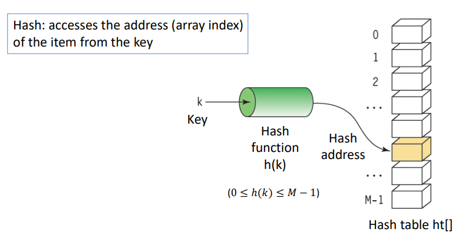
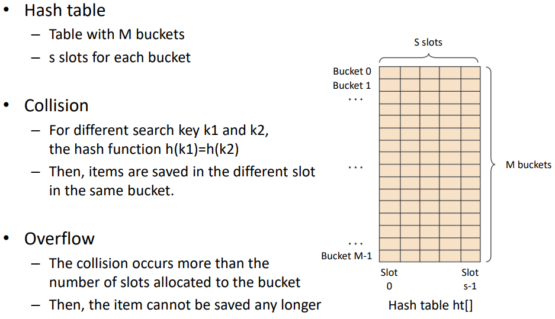

# 1.해시

## 개념
### 1. 해시
key(입력), value(출력) 값 비교를 통해 검색
- 시간 복잡도
    - unsorted data : O(n)
    - sorted data : O(log2n)

<u> <br> </u>

### 2. 해시함수

해시 함수(hash function)는 임의의 길이의 데이터를 고정된 길이의 데이터로 매핑하는 함수이다. 해시 함수에 의해 얻어지는 값(*value*)은 해시 값, 해시 코드, 해시 체크섬 또는 간단하게 해시라고 한다.

* 입력된 값의 길이가 달라도 언제나 고정된 길이(일정한 비트열)로 반환.

* 에시) SHA 256 : 해시의 결과가 256bits. 입력할 수 있는 값은 무제한.

* 종류 : division, folding, median-square, bit extraction, numerical analysis

<u> <br> </u>

### 3. 해시 테이블
효율적인 탐색을 위한 자료구조로 key를 value에 대응시킨다. 해시함수로 해시 코드를 계산하고 그 해시 코드를 이용해 인덱스를 찾는다.
* 구현 방법
    1. 해시 함수(hash function)으로 해시코드를 계산합니다. 
    2. 해시값(해시코드) % array_length 등과 같이 배열의 인덱스를 구한다. 물론 서로 다른 두개의 해시코드가 같은 인덱스를 가리킬 수도 있습니다.
    3. 배열의 각 인덱스에는 키(Key)와 값(Value) 로 이루어진 연결리스트를 선언합니다. 이러한 충돌 문제를 해결하기 위한 아이디어를 Chaining이라고 합니다. **충돌(Collision)** 이란 서로 다른 두개의 키가 같은 해시코드를 가리키거나 서로 다른 두개의 해시코드가 같은 인덱스를 가리키는 경우를 말합니다.

<u> <br> </u><u> <br> </u>
<hr/>
<u> <br> </u><u> <br> </u>

### 해시


### 해시테이블


<u> <br> </u><u> <br> </u>
<hr/>
<u> <br> </u><u> <br> </u>

## psuedo code
```
```
<u> <br> </u><u> <br> </u>
<hr/>
<u> <br> </u><u> <br> </u>
참고 사이트

* <https://ko.wikipedia.org/wiki/%ED%95%B4%EC%8B%9C_%ED%95%A8%EC%88%98/>
* <https://m.blog.naver.com/PostView.nhn?blogId=mage7th&logNo=221494489570&proxyReferer=https:%2F%2Fwww.google.com%2F/>
* <https://developside.tistory.com/92>