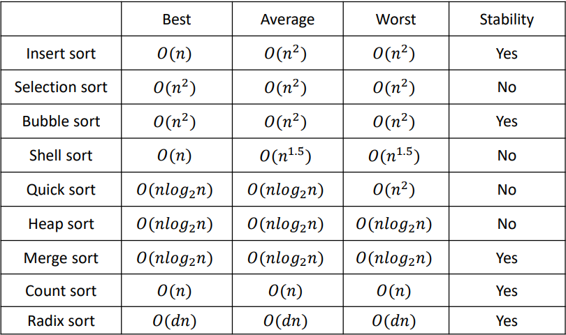
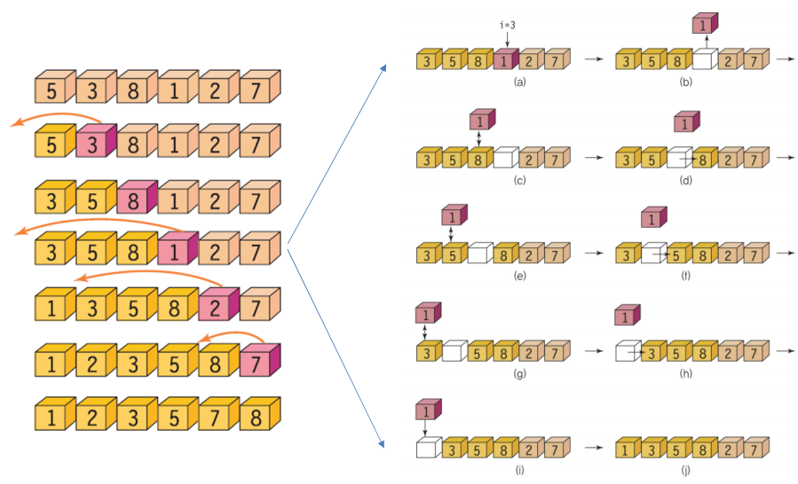
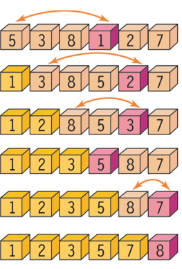
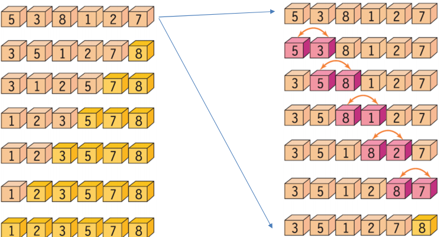
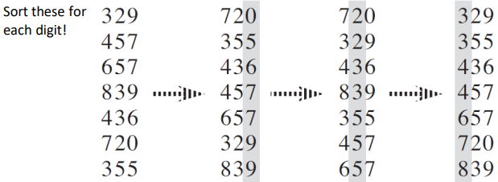
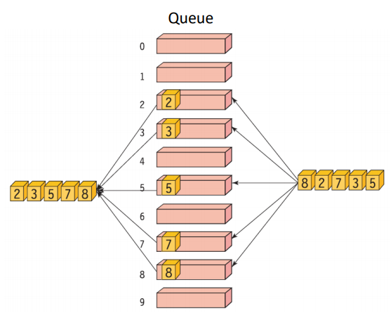
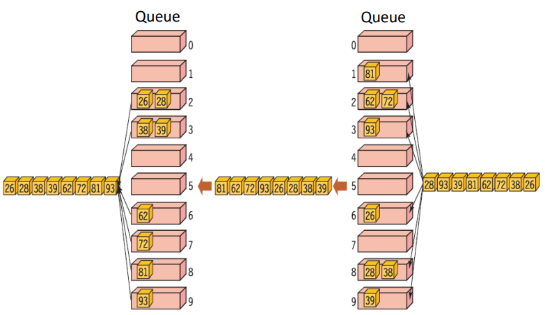

# 2. 정렬

## 개념
### 1. 정렬의 개념과 종류
#### 개념
데이터를 오름차순 혹은 내림차순으로 정리한 것

데이터를 검색할 때 필수적

다양한 정렬 알고리즘 중 최선의 알고리즘을 선택해야 함.

- 레코드(Record) : 정렬의 대상. 다양한 필드로 구성되어 있고 레코드를 구분 하기 위해 key field 활용.
- 내부 정렬 : 메인 메모리에 저장되어 있는 데이터 셋을 정렬
- 외부 정렬 : 외부 저장소에 대부분 저장되어 있고 메인 메모리에 일부만 저장되어 있는 데이터 셋 정렬
- 안정성 : 서로 다른 key가 동일한 value 값을 가졌을 때 이 key의 순서가 바뀌지 않도록 하는 것.

|①30 ②30 ⑫10 ④20| -> |⑫10 ④20 ①30 ②30 | : 1,2 순서 유지될 수 있도록 하는 것

#### 종류
</img>

- 단순하지만 비효율적인 알고리즘 : 삽입 정렬, 선택 정렬, 버블 정렬
- 복잡하지만 효율적인 알고리즘 : 퀵 정렬, 힙 정렬, 병합 정렬(merge sort), 기수 정렬(radix sort)
- 분할 정복 기법 : 퀵 정렬, 병합 정렬

#### input
- input array: 좌 / 우측 배열로 분류
    - 좌측 배열 : 정렬된 데이터
    - 우측 배열 : 정렬되지 않은 데이터

<u> <br> </u>
<hr/>
<u> <br> </u>

### 2. 삽입 정렬
</img>

#### Procedure
1. 우측 배열 가장 첫 데이터를 선택
2. 좌측 배열과 비교해서 알맞은 위치에 삽입
3. 우측 배열이 empty할 때까지 반복

#### Psuedo code
```
insertion_sort(A, n)
for i ← 1 to n-1 do  //i=1부터 시작
    key ← A[i];  //배열의 i번째 원소 추출
    j ← i-1; //정렬된 배열, 즉 좌측에 있는 배열에 대한 인덱스 값 j. i-1부터 0까지 탐색
    while j≥0 and A[j]>key do  // 좌측 배열의 값이 key 값보다 크면
        A[j+1] ← A[j];  //j 번째 데이터를 j+1 번째, 다음 칸으로 이동
        j ← j-1;  //j 값은 줄여서 한 칸 앞과 비교. 만약 j번 째 값이 key보다 작으면 break
    A[j+1] ← key  //j 값이 key보다 작기 떄문에 j+1번째 값이 key값이 됨.


void insertion_sort(int list[], int n)
{
    int i, j, key;
    for (i = 1; i<n; i++) {
        key = list[i];
        for (j = i - 1; j >= 0 && list[j]>key; j--)
           list[j + 1] = list[j];
        list[j + 1] = key;
    }
}
```
#### 시간 복잡도
- Best case : 데이터가 이미 정렬된 경우
    - 비교 횟수 : n-1
    - 이동 횟수 : 0

- Worst case : 완전히 정반대로 정렬되어 있는 경우
    - 비교 횟수 : n(n-1)/2, O(n^2)
    - 이동 횟수 : n(n-1)/2 +2(n-1), O(n^2)

- 데이터 크기가 커지면 시간 복잡도가 급속도로 커짐
- 안정성 보장
- 데이터가 대부분 정렬되어 있는 경우 효율적

<u> <br> </u>
<hr/>
<u> <br> </u>

### 3. 선택 정렬
 </img>

#### Procedure
1. 우측 배열에서 가장 작은 값을 선택하여 0번 인덱스에 위치한 데이터와 교환
2. 좌측 배열 크기는 ++ / 우측 배열 크기는 --
3. 우측 배열이 empty할 때까지 반복

#### Psuedo code
```
selection_sort(A, n)
for i←0 to n-2 do
    least ← an index of the smallest value among A[i], A[i+1],..., A[n-1];
    Swap A[i] and A[least];
    i++;


#define SWAP(x, y, t) ( (t)=(x), (x)=(y), (y)=(t) )
void selection_sort(int list[], int n)
{
    int i, j, least, temp;
    for (i = 0; i < n-1; i++) {
        least = i;
        for (j = i + 1; j<n; j++)
            if (list[j]<list[least]) least = j;
        SWAP(list[i], list[least], temp);
    }
}
```


<u> <br> </u>
<hr/>
<u> <br> </u>

### 4. 버블 정렬
</img>

#### Procedure
1. 정렬되어 있지 않으면 인접해 있는 두 개의 데이터 교환
2. 왼쪽에서 오른쪽으로 계속 반복.

#### Pseudo code
```
BubbleSort(A, n)
for i←n-1 to 1 do
    for j←0 to i-1 do
        Swap if when j and j+1 elements are not in order
        j++;
    i--;


#define SWAP(x, y, t) ( (t)=(x), (x)=(y), (y)=(t) )
void bubble_sort(int list[], int n)
{
    int i, j, temp;
    for (i = n - 1; i>0; i--) {
        for (j = 0; j<i; j++)
            if (list[j]>list[j + 1])
                SWAP(list[j], list[j + 1], temp);
    }
}
```

#### 시간 복잡도
- Best case : 데이터가 이미 정렬된 경우
    - 비교 횟수 : n(n-1)/2
    - 이동 횟수 : 0

- Worst case : 완전히 반대로 정렬되어 있는 경우
    - 비교 횟수 : n(n-1)/2
    - 이동 횟수 : 3n(n-1)/2 (comparison 횟수*3)

- 안정성 보장    

<u> <br> </u><u> <br> </u>
<hr/>
<u> <br> </u><u> <br> </u>

### [Optional] 기수 정렬 (Radix sort)
#### key idea
n자리의 숫자를 각 자리수 별로 정렬. (n<20 일때 효율적)

</img>

#### Psuedo code
```
RadixSort(A, d)
    for i=1 to d
        StableSort(A) on digit i
```

#### 시간 복잡도
- O(d(n+k))
    - d 자리 수의 n 개의 숫자를 가지고 있을 때 패스 횟수는 0에서 k까지
    - 각 패스별 시간 복잡도 : O(n+k)
    - d가 상수인 경우 k = O(n)
    - Example: sort 1 million 64-bit numbers => O(4(n+2^16))

      Treat the data as four-digit radix

      Each digit ranges 0~2^16 -1

#### queue를 활용한 기수 정렬
1. 1의 자리 수 정렬

</img>     

2. 10의 자리 수 정렬 : 1의 자리 수 먼저 정렬 -> 10의 자리 수 정렬

</img>       

```
#define BUCKETS 10
#define DIGITS 4
void radix_sort(int list[], int n)
{
    int i, b, d, factor = 1;
    QueueType queues[BUCKETS];
    for (b = 0; b<BUCKETS; b++) init(&queues[b]); // Initialize queues
    for (d = 0; d<DIGITS; d++) {
        for (i = 0; i<n; i++) // Add the data into queues
            enqueue(&queues[(list[i] / factor) % BUCKETS], list[i]);
        for (b = i = 0; b<BUCKETS; b++) // Extract from queues
            while (!is_empty(&queues[b]))
                list[i++] = dequeue(&queues[b]);
        factor *= BUCKETS; // Process next digit
    }
}

```
<u> <br> </u><u> <br> </u>
<hr/>
<u> <br> </u><u> <br> </u>

### JAVA에서 배열 정렬하기 Arrays.sort()
```import java.uitl.Arrays;```
- java.util.Arrays 클래스의 sort() 메소드 사용하면 배열이나 리스트 정렬 가능
    - 기본 오름차순 : ```Arrays.sort(array 명)```
    - 내림차순 정렬 : Collections 클래스의 reverse Order()함수 사용.
    ```
    Arrays.sort(arr, Collections.reverseOrder());
    ```
    - 배열의 일부분만 정렬 : ```Arrays.sort(array 명, 시작 index, 끝 index);```

<br>

- 객체 배열 정렬 : 객체 클래스가 Comparable 인터페이스의 compareTo() 메소드를 구현하고 있어야 정렬됨.
```
class People implements Comparable {

    private String name;
    private int age;
    
    public People(String name, int age){
        this.name = name;
        this.age= age;
    }

    public String print(){
        return name+"("+age+")";
    }

    @Override
    public int compareTo(People people) {
         // TODO Auto-generated method stub
         if (this.age < people.age) {
             return -1;
         } else if (this.age == people.age) {
             return 0;
         } else {
             return 1;
         }
     }
    }

    public class Sort{
         public static void main(String[] args)  {
             People[] arr = { new People("상현", 20)
                , new People("철수", 14)
                , new People("경완", 31)
                , new People("대호", 40)
                , new People("지운", 24) 
            };
            
            Arrays.sort(arr); //오름차순 정렬
            
            for (People i : arr) { //오름차순 출력
                System.out.print("["+i.print()+"]");
            }
            
            Arrays.sort(arr,Collections.reverseOrder()); //내림차순 정렬
            System.out.println();
            
            for (People i : arr) { //내림차순 출력
                System.out.print("["+i.print()+"]");
            }
        }
    }
```


<u> <br> </u>
<hr />
<u> <br> </u>

참고 사이트

https://coding-factory.tistory.com/549

https://gmlwjd9405.github.io/2018/09/06/java-comparable-and-comparator.html

<u> <br> </u>
<hr />
<u> <br> </u>

노트
- 정렬 문제는 Collections 활용하는 방식
- Collections의 comparable, comparator 인터페이스 공부
- 중복 없애려면 Set 활용! (hashset, sortedset(사전순 정렬 지원))