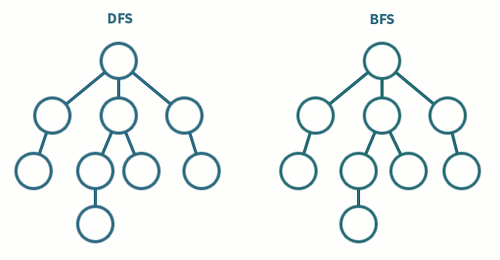
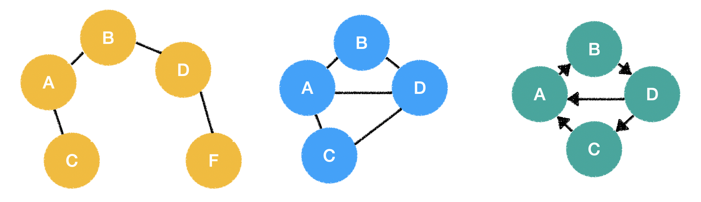
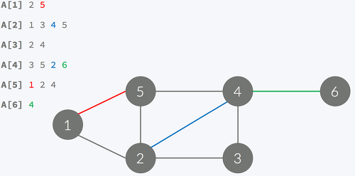
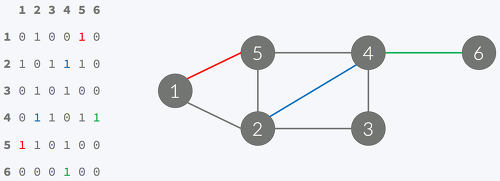
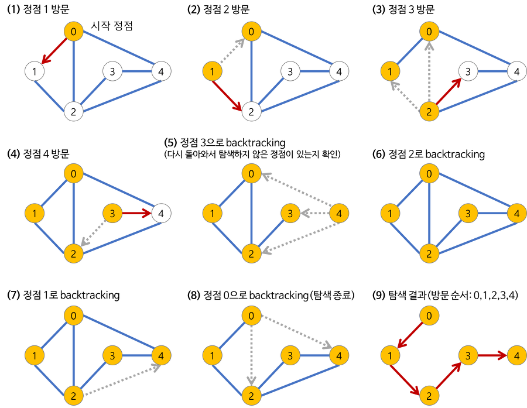

# 3. BFS/DFS

## 1. BFS / DFS
- 완전 탐색
- BFS : Breadth First Search. 큐 활용
- DFS : Depth First Search. 스택 활용

<br><br>    <br>    <br>    <br>    <br>  <br>    <br>    <br>      <br>    <br>    <br>    

- 구현에는 인접 리스트 혹은 인접 행렬 활용

<u> <br> </u>
<hr/>
<u> <br> </u>

## *그래프*
노드와 노드를 연결하는 간선을 하나로 모아놓은 비선형 자료 구조


그래프 탐색 : 하나의 정점으로부터 시작해 차례대로 모든 정점들을 한번씩 방문

트리도 그래프의 일종
- 표현 : G = ( V , E )
    - G : graph, V : vertex (node), E : edge

<br>

## *인접 리스트*


- 정점과 연결되어있는 간선을 저장
    -ex) 1에 연결되어있는 간선들은 [1]에 저장 

<br>

## *인접 행렬*


- 정점 V가 n개일 때 N*N 이차원 배열로 나타냄
- 연결 되어있으면 1로 표시
    - 1 : 정점 간의 간선이 존재, 0 : 간선 존재하지 않음
    - 가중치 그래프일 경우 가중치를 넣음

<u> <br> </u>
<hr/>
<u> <br> </u>

## 2. BFS
#### 개념
루트 노드에서 시작해서 인접한 노드를 먼저 탐색

시작 정점으로부터 가까운 정점을 먼저 방문하고 멀리 떨어져 있는 정점을 나중에 방문

두 노드 사이의 최단 경로 혹은 임의의 경로를 찾고 싶을 때 사용

#### 특징
- 재귀적 동작 아님
- 그래프 탐색의 경우 어떤 노드를 방문했는지 여부를 반드시 검사해야 함.
- FIFO 원칙 탐색. (Queue 활용)

#### Procedure


#### java code
```
public static void bfs(int[][] a, boolean[] c, int v) {
		Queue<Integer> q = new LinkedList<>();
		int n = a.length - 1;

		q.add(v);
		c[v] = true;

		while (!q.isEmpty()) {

			v = q.poll();
			System.out.print(v + " ");
			
			for (int i = 1; i <= n; i++) {

				if (a[v][i] == 1 && !c[i]) {
					q.add(i);
					c[i] = true;
				}

			}
		}

	}

```

<u> <br> </u>
<hr/>
<u> <br> </u>

## 3. DFS
#### 개념
루트 노드에서 시작해서 다음 분기로 넘어가기 전에 해당 분기를 완벽하게 탐색하는 방법

검색 속도 자체는 BFS에 비해서 느리지만 간단하게 구현할 수 있고 모든 노드를 방분하고자 하는 경우 이 방법 선택.

#### 특징
- 자기 자신을 호출하는 순환 알고리즘의 형태
- 어떤 노드를 방문했는지 여부를 반드시 검사해야 함

#### Procedure


#### 시간 복잡도
- 인접 리스트 : O(V + E)
- 인접 행렬 : O(V^2)

#### java code
```
public static void dfs(int[][] a, boolean[] c, int v, boolean flag) { 
    //a : 인접행렬, c : 방문여부, v : 정점

    Stack<Integer> stack = new Stack<>(); 
    int n = a.length - 1; 

    stack.push(v); 
    c[v] = true; 
    System.out.print(v + " "); 

    while (!stack.isEmpty()) { 
        int vv = stack.peek(); //읽기. top 에 변화 없음
        flag = false; 

        for (int i = 1; i <= n; i++) { 

            // 스택의 top에 잇는 정점을 기준으로 간선이 연결되어있고 아직 방문하지 않은 정점인 경우
            if (a[vv][i] == 1 && !c[i]) { 
                stack.push(i); 
                System.out.print(i + " "); 

                c[i] = true; 
                flag = true; 
                break; 
            } 
        } 

        if (!flag) { //연결된 간선이 없고 방문하지 않은 정점을 찾지못했을 경우
            stack.pop();
        } 
    } 
}

```

<u> <br> </u>
<hr />
<u> <br> </u>

참고 사이트

https://velog.io/@sohi_5/algorithmDFS

https://mygumi.tistory.com/102

https://yunyoung1819.tistory.com/86

<u> <br> </u>
<hr />
<u> <br> </u>

### 노트
- 희소 그래프 : (간선 별로 없는) 인접 리스트가 효율적
- 최소 비용 문제, 간선의 가중치 1인 경우, 정점과 간선이 작을 때 bfs 효율적